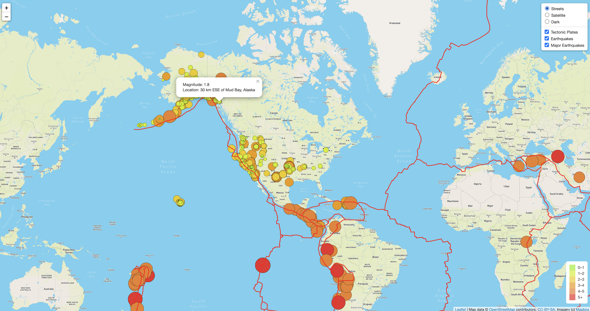

# **Mapping_Earthquakes**
- Visualizing the earthquake related data on a world map with interactive features using js, d3, leaflet and Mapbox.
- Using leaflet and mapbox multiple layers of maps are created and made interactive so that users can choose the layer they want to see on the map. Streets, Satellite and Dark maps are setup currently.
- GeoJSON data of tectonic plates, all earthquakes in the past 7 days and all major earthquakes of greater than 4.5 magnitude are plotted on different layers again giving users a choice to select the data they want to see on the map.
- Popup markers are configured to show the exact place and the magnitude of the earthquake.
- The circle markers size and colors are configured to change based on the magnitude of earthquake. Corresponding legend information is shown in a concise manner on the right bottom of the map.
- The webpage shows up as : 
- </img>
---
---
